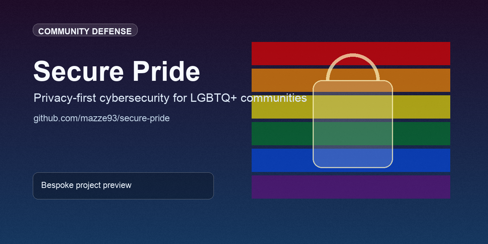

# 🔐 Secure Pride




**Privacy-first cybersecurity infrastructure for LGBTQ+ communities and other high-risk groups.**

We build tools, systems, and standards for people who cannot afford surveillance, exposure, or failure.

---

## 🧭 Why Secure Pride Exists

Security systems often assume neutrality. Reality is not neutral.

For many communities:

* Exposure = legal risk
* Data leakage = personal harm
* Surveillance = systemic targeting

**Secure Pride exists to close that gap.**

> Security is not optional—and it must not come at the cost of dignity.

---

## 🚀 Start Here

* 🧭 New contributor → [CONTRIBUTING.md](CONTRIBUTING.md)
* 🤖 AI-assisted work → [Copilot Instructions](docs/COPILOT-INSTRUCTIONS.md)
* ⚡ Fast rules → [Quick Reference](docs/QUICK-REFERENCE.md)

> All contributions must meet Secure Pride standards for privacy, accessibility, and production readiness.

Licensed under the [Apache License, Version 2.0](LICENSE).

---

## 🧱 What We Build

* 🔐 Privacy-first security tooling (no telemetry, no tracking)
* 🧠 AI-assisted development standards (with strict validation)
* ♿ Accessibility-first system design (neurodivergent inclusive)
* 🛡️ Operational frameworks for high-risk environments

This is not experimental code.
This is **production-intent infrastructure**.

---

## ⚖️ Core Principles

### 1. Privacy is a baseline, not a feature

* No analytics, tracking, or behavioral telemetry
* Data minimization enforced at design time

### 2. Security must assume adversarial conditions

* Threat models include legal, social, and institutional risk
* Defaults favor safety over convenience

### 3. Accessibility is non-negotiable

* Systems must be usable under cognitive load
* Interfaces must not require ideal conditions to function

### 4. AI is a tool—not an authority

* AI output is treated as **untrusted input**
* All generated code must be verified before use

---

## ❗ Non-Negotiables

All contributions **MUST**:

* ❌ Include zero telemetry or hidden data collection
* 🔐 Protect sensitive identity data (including SOGI)
* ♿ Meet accessibility standards (WCAG baseline)
* 🧪 Pass validation (tests, linting, security checks)
* 📖 Include clear documentation

Pull requests that violate these will not be reviewed.

---

## 🤖 AI-Assisted Development

We use AI intentionally—not passively.

### Required workflow:

1. Define security implications
2. Define accessibility impact
3. Generate code
4. Validate against Secure Pride standards

> AI-generated code is treated as **untrusted input until proven safe.**

See full guidelines:
👉 `docs/COPILOT-INSTRUCTIONS.md`

---

## ✅ Definition of Done

A contribution is complete when:

* [ ] Code is production-ready (no placeholders)
* [ ] Security considerations are documented
* [ ] Accessibility has been validated
* [ ] No sensitive data exposure risk exists
* [ ] Documentation is updated
* [ ] All checks pass (CI, lint, security)

---

## 🧪 Development

Key docs:

* **[Copilot Instructions](docs/COPILOT-INSTRUCTIONS.md)**
  → AI-assisted development standards

* **[Quick Reference](docs/QUICK-REFERENCE.md)**
  → Fast rules during implementation

---

## 🤝 Contributing

We welcome contributors aligned with the mission.

### Expectations:

* Respect the non-negotiables
* Prioritize safety over speed
* Build for real-world risk, not ideal conditions

Start here:
👉 [CONTRIBUTING.md](CONTRIBUTING.md)

---

## 🔐 Security Policy

If you discover a vulnerability:

📧 **[security@securepride.org](mailto:security@securepride.org)**

* Do not open public issues for vulnerabilities
* Provide detailed reproduction steps
* Allow time for responsible disclosure

---

## 📬 Contact

* 🌐 Website: https://securepride.org
* 📧 General: [hello@securepride.org](mailto:hello@securepride.org)
* 🔐 Security: [security@securepride.org](mailto:security@securepride.org)

---

## 🧠 Positioning

Secure Pride operates at the intersection of:

* cybersecurity infrastructure
* human-centered design
* high-risk community protection

This is not a generic open-source project.

It is **mission-critical infrastructure for people who cannot fail safely.**

---

## 📦 Project Structure (Evolving)

```
/docs
  ├── COPILOT-INSTRUCTIONS.md
  ├── QUICK-REFERENCE.md

/.github
  ├── workflows/
  ├── ISSUE_TEMPLATE/
  ├── PULL_REQUEST_TEMPLATE.md
```

---

## 📜 License

Apache License 2.0

See: [LICENSE](LICENSE)

---

## 🚀 Roadmap (High-Level)

* [ ] Secure container templates (reproducible + auditable)
* [ ] Privacy-first deployment pipelines
* [ ] Accessibility validation tooling
* [ ] Community security playbooks

---

## 🧩 Final Note

Most software optimizes for scale.

We optimize for **safety under pressure**.

That constraint changes everything.
