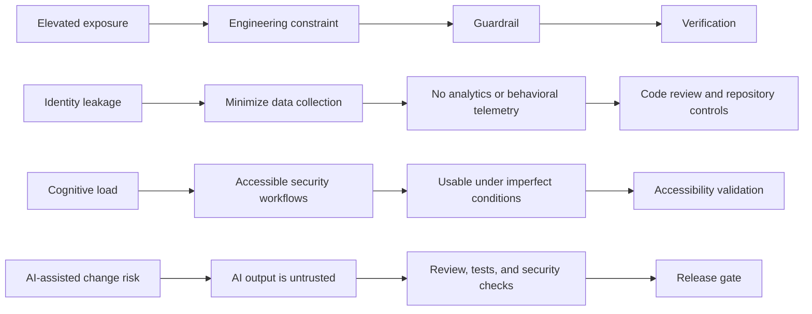

# Secure Pride

> **Security infrastructure for people who cannot fail safely.**

Secure Pride is an open-source security project for LGBTQ+ communities and other people operating under elevated exposure, surveillance, or institutional risk.

It treats legal risk, identity exposure, cognitive load, limited staffing, and the cost of a wrong security decision as engineering inputs—not edge cases.

[Visit the project](https://securepride.org) · [Use the AI Safety Scanner](https://securepride.org/tools/scanner) · [Read the security policy](SECURITY.md) · [Contribute](CONTRIBUTING.md)

---

## Operating condition

A privacy failure is not equally recoverable.

For someone operating under elevated exposure:

- A leaked identity signal can create legal, employment, or personal risk.
- Behavioral telemetry can become a targeting mechanism.
- A control that assumes time, expertise, and ideal conditions can fail when it matters most.

**Secure Pride designs from that condition outward.**

## Shipped surfaces

| Surface | What it provides | Runtime / boundary |
| --- | --- | --- |
| [Secure Pride web platform](https://securepride.org) | Public project entry point, documentation, and security resources | Astro on Cloudflare Pages |
| [AI Safety Scanner](https://securepride.org/tools/scanner) | Bounded AI-assisted analysis with validation-oriented workflows | Cloudflare runtime; treat outputs as untrusted until reviewed |
| Static distribution | Self-contained build for containerized local use | Docker serves the static build only |
| Security development controls | Contribution rules, AI-development guidance, architecture decisions, and release procedures | Version-controlled documentation |

> **Scope boundary:** Cloudflare Pages Functions, including `/api/scan` and `/api/health`, are not bundled into the Docker image. Use `npx wrangler pages dev` for full-stack local development.

## Security posture

| Invariant | Engineering consequence |
| --- | --- |
| **Privacy is a baseline** | No analytics, tracking, or behavioral telemetry; minimize sensitive data at design time. |
| **Threats are adversarial** | Model legal, social, institutional, and technical exposure; prefer safe defaults over convenience. |
| **Accessibility is a security property** | Design for cognitive load, imperfect conditions, and users who cannot rely on ideal workflows. |
| **AI is not an authority** | Treat AI output as untrusted input; verify generated code and security claims before use. |
| **Production readiness matters** | Validate code, security, accessibility, and documentation before release. |

## How we make claims checkable


```mermaid
flowchart LR
    R[Elevated exposure] --> C[Engineering constraint]
    C --> G[Guardrail]
    G --> V[Verification]

    R1[Identity leakage] --> C1[Minimize data collection]
    C1 --> G1[No analytics or behavioral telemetry]
    G1 --> V1[Code review and repository controls]

    R2[Cognitive load] --> C2[Accessible security workflows]
    C2 --> G2[Usable under imperfect conditions]
    G2 --> V2[Accessibility validation]

    R3[AI-assisted change risk] --> C3[AI output is untrusted]
    C3 --> G3[Review, tests, and security checks]
    G3 --> V3[Release gate]
```

A stated risk should produce a concrete engineering constraint, a guardrail, and a way to verify that the constraint is being enforced.

## Run locally

Built with [Astro](https://astro.build) and deployed to Cloudflare Pages.

```bash
npm install
npm run dev
npm run build
npm run check
```

For the static container:

```bash
docker build -t secure-pride .
docker run -p 8080:8080 secure-pride
```

Published image: `ghcr.io/mazze93/secure-pride`. Release, scan-gate, and
publish pipeline: [docs/DOCKER_IMAGE_WORKFLOW.md](docs/DOCKER_IMAGE_WORKFLOW.md).

## Contribution gate

A change is not ready to merge unless it:

- Preserves the no-telemetry and sensitive-data-minimization baseline.
- Meets applicable accessibility, test, lint, and security checks.
- Documents changed behavior, threat assumptions, or operational procedures.

Read [CONTRIBUTING.md](CONTRIBUTING.md), the [AI Development Charter](docs/COPILOT-INSTRUCTIONS.md), and the [Quick Reference](docs/QUICK-REFERENCE.md) before opening a pull request.

## Report a vulnerability

Do not open a public issue for a suspected vulnerability.

Email [security@securepride.org](mailto:security@securepride.org) with reproduction details and allow time for responsible disclosure. See [SECURITY.md](SECURITY.md) for the disclosure process.

For non-security questions: [hello@securepride.org](mailto:hello@securepride.org).

## Roadmap

Planned work is intentionally separate from the shipped surface.

- [ ] Reproducible, auditable container templates
- [ ] Privacy-preserving deployment pipelines
- [ ] Accessibility validation tooling
- [ ] Community security playbooks

See the project documentation for implementation milestones and historical work.

## License

Apache License 2.0. See [LICENSE](LICENSE).
